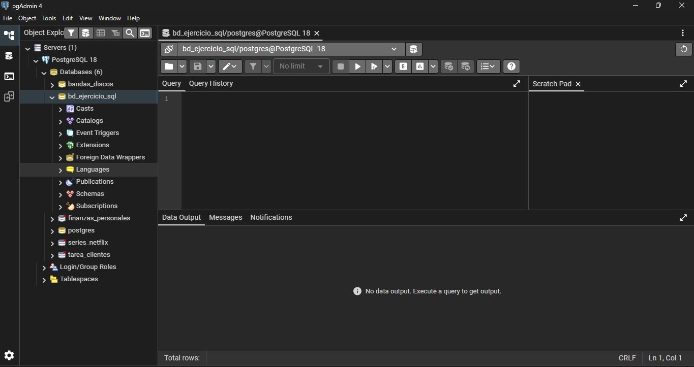
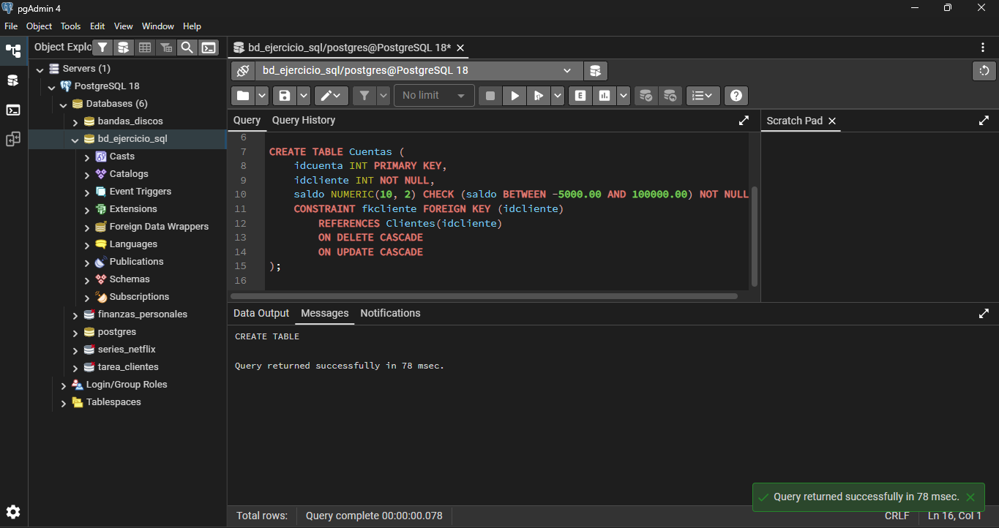
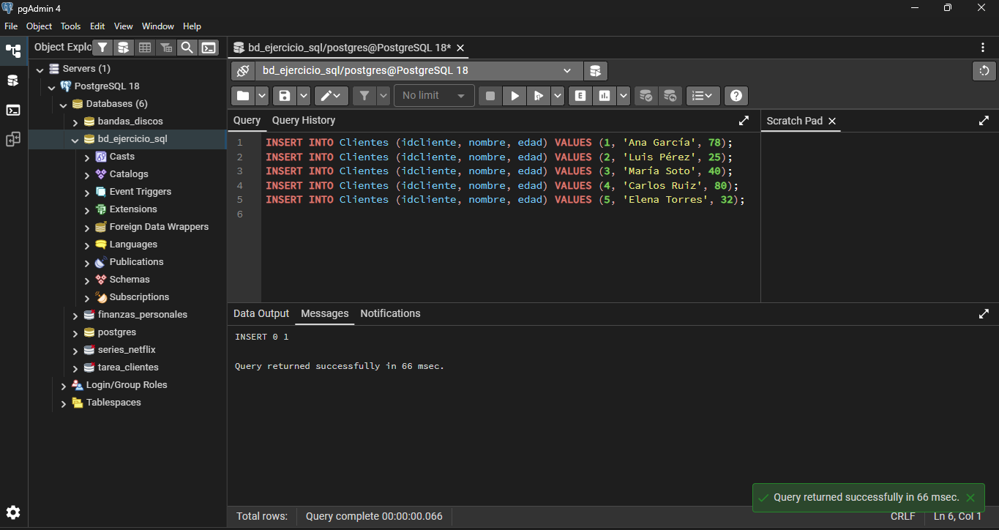
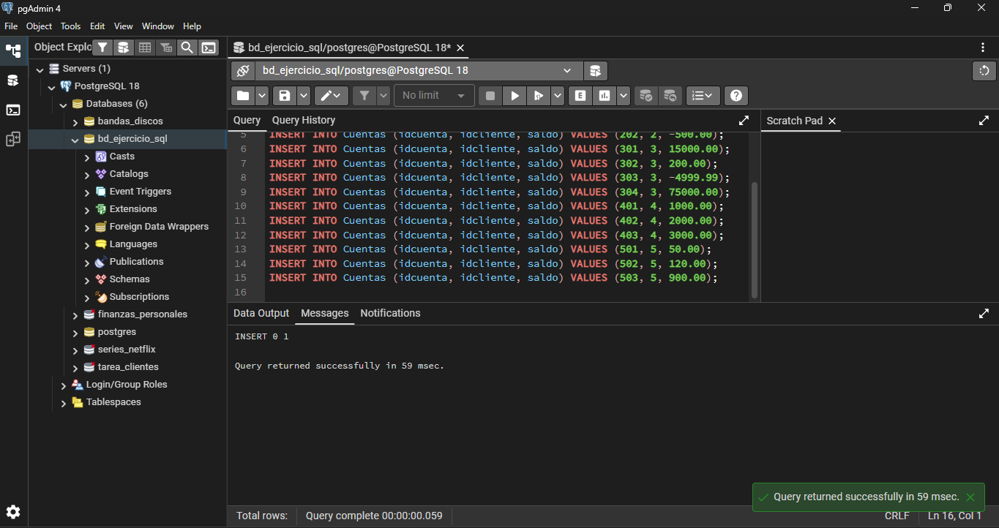
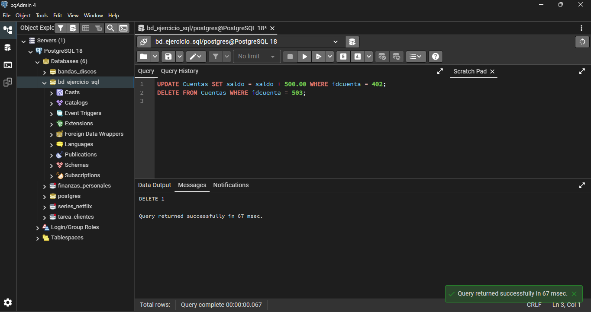
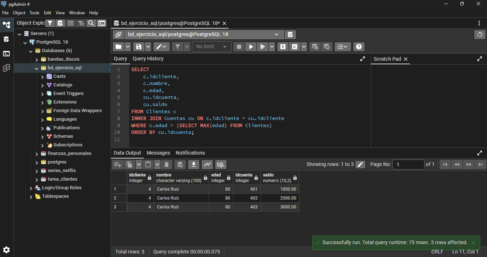
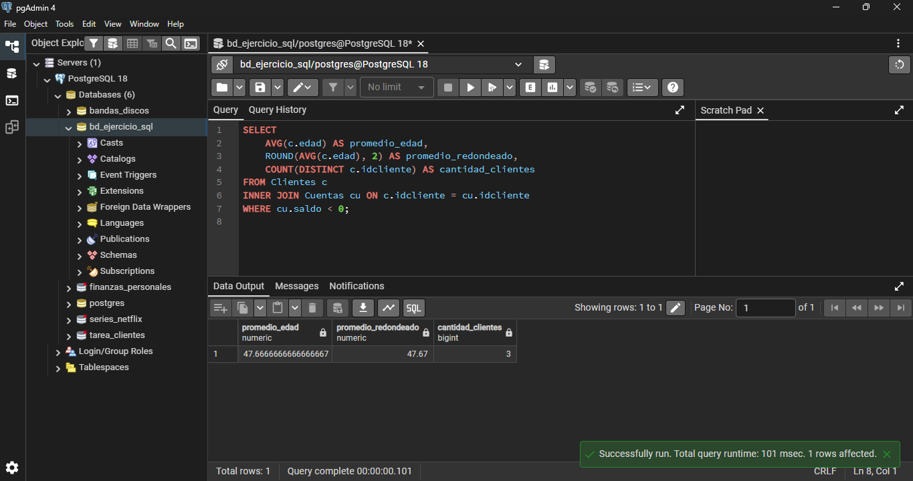
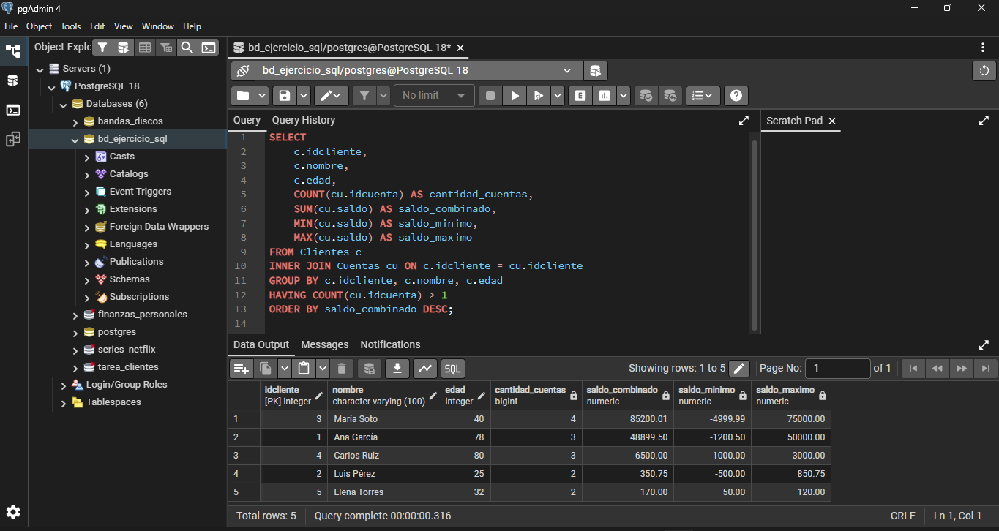
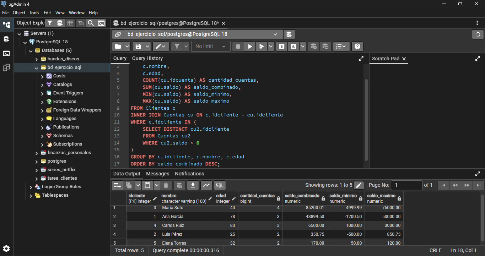

# Ejercicio Práctico - SQL: Llaves, DDL/DML y Consultas de Agregación

En este ejercicio se crean tablas en SQL con relaciones entre ellas, con insertar datos y hacer consultas con funciones como COUNT, SUM, AVG, etc.

## Paso 1: Crear la base de datos

Primero creé una base de datos nueva llamada `bd_ejercicio_sql` en pgAdmin 4.

## Paso 2: Crear las tablas Clientes y Cuentas

Creé 2 tablas relacionadas:

**Tabla Clientes**
**Tabla Cuentas**

## Paso 3: Insertar 5 clientes

Inserté clientes con sus edades:

## Paso 4: Insertar 15 cuentas

Repartí 15 cuentas entre los 5 clientes:

## Paso 5: Hacer UPDATE y DELETE

Hice dos operaciones:

**UPDATE**: Le sumé $500 a la cuenta 402

**DELETE**: Borré la cuenta 503

Ahora quedan 14 cuentas en total.

## Paso 6: Las consultas que pedían

### Consulta 3: Ver las cuentas del cliente más viejo

Esta consulta muestra todas las cuentas de Carlos Ruiz que tiene 80 años.

### Consulta 4: Promedio de edad de los que tienen saldo negativo

Aquí calculé el promedio de edad de los clientes que tienen al menos una cuenta con saldo negativo.

### Consulta 5: Clientes con más de una cuenta

Esta consulta lista todos los clientes que tienen más de 1 cuenta.

### Consulta 6: Saldo total de cada cliente

Aquí sumé todos los saldos de cada cliente que tiene más de una cuenta.

### Consulta 7: Clientes con al menos una cuenta en negativo

Esta consulta muestra solo los clientes que tienen mínimo una cuenta con saldo negativo.

## Archivos

- `ejercicio_completo.sql` - El script SQL completo con creación de tablas y todas las consultas
- `README.md` - Este archivo de documentación
- `img/` - Capturas de pantalla de los resultados de cada consulta

## Autor

Patricio Valenzuela Henriquez

## Repositorio GitHub

https://github.com/PATRICIORVH/modulo-05-05

